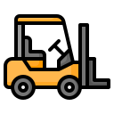

# 🚧 Industrial Forklift Safety AI System

🔒 Ensuring Person Safety, Collision Avoidance & Workplace Security in Industrial Warehouses

<!-- README.md for Safe Industrial Zone AI System -->

  

<h2 align="center">
  🚧 AI-Powered Forklift Safety System for Industrial Warehouses
</h2>

  Real-time person detection, red-zone collision alerts, and portal-based safety reporting to secure your workplace.

  
  
  
  

---

## 📌 Overview

**Safe Industrial Zone** is an embedded AI solution deployed on forklifts in busy industrial environments to **ensure human safety, collision avoidance, and incident tracking**. Built with **Jetson Xavier NX**, **TensorRT**, and **OpenCV**, the system provides:

- ✅ 360° perception with 4 wide-angle cameras (120° FOV each)
- ✅ Red-zone monitoring with a defined **5-meter safety perimeter**
- ✅ Instant alerts to drivers using HMI interfaces (buzzer/LED)
- ✅ Logs all safety events to a centralized **accident avoidance portal**

This system is **live in production**, helping prevent accidents and ensure compliance with warehouse safety policies.

---

## ✨ Features

| Feature | Status |
|--------|--------|
| 🧍 Person detection and vehicle detection | ✅ Implemented |
| 🔴 5-meter Red Zone dynamic perimeter | ✅ Implemented |
| 🎥 Multi-camera (4x) 120° coverage | ✅ Implemented |
| ⚠️ Real-time driver alerts (LED + buzzer) | ✅ Implemented |
| 📊 Safety event logging with image snapshot | ✅ Implemented |
| ☁️ Cloud-based safety portal dashboard | ✅ Implemented |
| 🚀 Runs on Jetson Xavier NX (TensorRT + CUDA) | ✅ Optimized & tested |
| 🔌 Easy power integration, industrial deploy-ready | ✅ Field-tested |

---

## 🧠 Technology Stack

| Stack | Details |
|-------|---------|
| 🔋 Hardware | Jetson Xavier NX, 4x wide-angle USB cameras, 12V DC input |
| ⚙️ Software | Python 3.8+, OpenCV 4.2, TensorRT 7.1, CUDA 10.2 |
| 📶 Network | MQTT/REST APIs to send alerts to portal |
| 📷 AI Model | Optimized YOLOv8 model for person & object detection |
| 📁 Portal | Web dashboard (React + Firebase) for analytics |

---

## 🗂️ System Design Overview

### 🌐 Safety Portal Integration
Every red-zone violation or safety warning is logged remotely for review by safety officers.

### 📝 Log details include:

- 📅 Timestamp
- 🚜 Forklift ID
- 🧍 Object Detected (e.g. person, vehicle)
- 📸 Snapshot Image
- 📍 GPS/Zone (optional)

✅ These logs power heatmaps, trend analysis, and near-miss reports via the central portal.

### 🎬 Demo Preview

  

